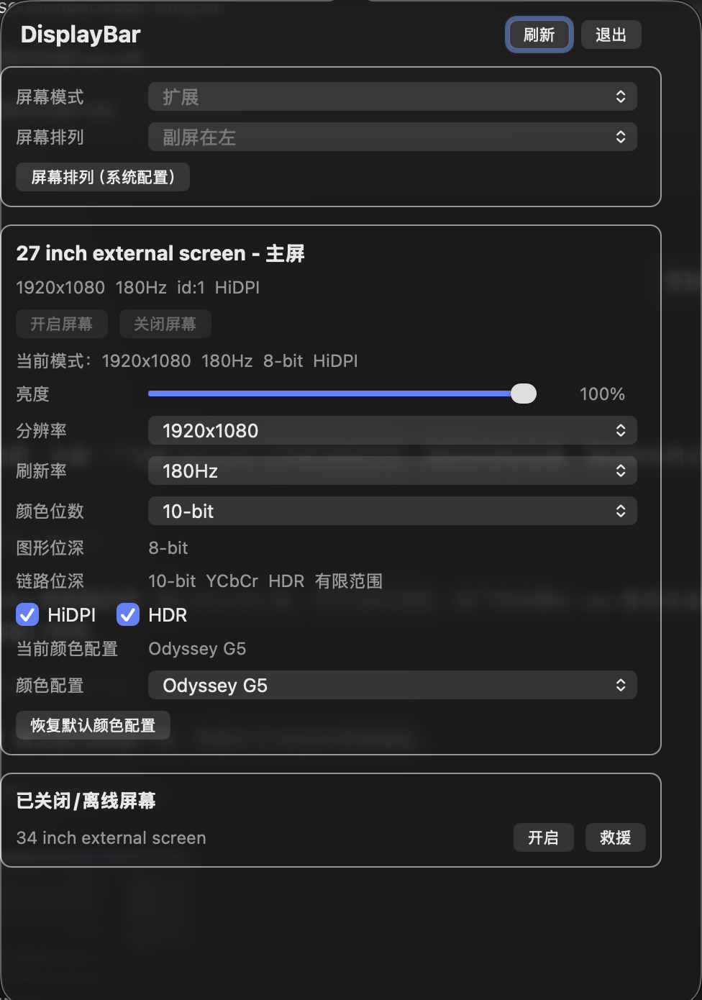

# DisplayBar

[English README](README.en.md)

DisplayBar 是一个 macOS 状态栏显示器控制工具，用来快速管理外接屏幕。
它基于 `displayplacer`，并额外打包了几个本地 helper，用来处理
`displayplacer` 本身没有直接暴露的能力，例如 HDR 和 ColorSync 颜色配置。



## 下载

最新可用版本在 GitHub Releases：

[下载 DisplayBar-0.1.0.dmg](https://github.com/StrikeNull/mac-display-control-tool/releases/download/v0.1.0/DisplayBar-0.1.0.dmg)

打开 DMG 后，把 `DisplayBar.app` 拖到 `Applications` 即可。

当前 App 使用 ad-hoc 签名，已经避免 App bundle 签名结构损坏，但还没有使用 Apple
Developer ID 签名和 notarize。首次打开时 macOS 仍可能会拦截。如果你信任这个开源项目，
可以在“系统设置 > 隐私与安全性”里允许打开，或右键 App 选择“打开”。通常不需要执行命令；
如果被下载工具额外加了隔离属性，才可能需要手动移除 quarantine。

## 适合谁

- 经常在 macOS 上切换多屏配置的人。
- 外接屏需要频繁调整分辨率、刷新率、HiDPI 或 HDR 的人。
- 希望像 Windows 一样快速切换扩展、复制、仅主屏、仅副屏的人。
- 需要快速切换 ColorSync 颜色配置的外接屏用户。

这个工具主要面向个人多屏场景：快速开启或关闭某个屏幕、切换分辨率和刷新率、
开启或关闭 HiDPI/HDR、设置主屏幕、切换 ColorSync 颜色配置，以及在需要手动调整时
直接跳转到 macOS 的显示器排列设置。

## 功能

- 状态栏 popover 界面，修改设置时不会因为点击控件就自动关闭。
- 菜单栏固定显示 `DB` 入口，避免后台运行但入口不可见。
- 支持开机启动。
- 展示当前在线屏幕。
- 内置屏幕会参与显示和模式配置，但不提供关闭/救援开启控制。
- 通过 `displayplacer` 开启或关闭屏幕。
- 对被关闭或离线的历史屏幕提供恢复入口。
- 对消失的屏幕提供 patched `displayplacer` 救援路径。
- 设置显示模式：
  - 分辨率
  - 刷新率
  - HiDPI 缩放
  - 基于 connection mode 的颜色位数
- 读取并调节 macOS 暴露的软件亮度。
- 通过 macOS 私有显示 API 按屏幕开启或关闭 HDR。
- 设置主屏幕。
- 切换屏幕模式：
  - 扩展
  - 复制
  - 仅主屏
  - 仅副屏
- 设置简单的副屏排列：
  - 副屏在左
  - 副屏在右
  - 副屏在上
  - 副屏在下
- 直接打开 macOS 显示器系统设置，用于系统级屏幕排列。
- 读取并设置每个屏幕的 ColorSync 颜色配置。

## 系统要求

- macOS。
- 支持外接屏幕的 Apple Silicon 或 Intel Mac。
- 构建时需要 Xcode Command Line Tools。

下载版会优先使用 App 内置的 `displayplacer`。源码运行时会按顺序查找：
`DISPLAYPLACER`、App Resources、`/opt/homebrew/bin/displayplacer`、`/usr/local/bin/displayplacer`。
如果你想指定自己的 `displayplacer`，可以设置环境变量：

```zsh
DISPLAYPLACER=/path/to/displayplacer
```

## 构建

在仓库根目录运行：

```zsh
./statusbar-tool/build.sh
```

生成的 App 在：

```text
statusbar-tool/build/DisplayBar.app
```

构建脚本会同时编译：

- Swift 状态栏 App
- `hdrctl`
- `profilectl`
- 打包到 App Resources 内的 helper

## 自行打包 DMG

从源码生成可下载、可拖入 Applications 的 DMG：

```zsh
./scripts/package-dmg.sh
```

输出文件：

```text
dist/DisplayBar-0.1.0.dmg
```

## 运行

从仓库直接运行：

```zsh
./statusbar-tool/run.sh
```

或打开构建后的 App：

```zsh
open statusbar-tool/build/DisplayBar.app
```

当在线屏幕多于一个时，状态栏图标会显示当前在线屏幕数量。

## 环境变量

可选配置：

```zsh
DISPLAYPLACER=/path/to/displayplacer
DISPLAY_CONTROL_TOOL_HOME=/path/to/display-control-tool
```

## Helper 用法

HDR：

```zsh
./statusbar-tool/build/hdrctl status 1 3
./statusbar-tool/build/hdrctl on 1
./statusbar-tool/build/hdrctl off 1
```

ColorSync 颜色配置：

```zsh
./statusbar-tool/build/profilectl list 1 3
./statusbar-tool/build/profilectl set 1 1 /Library/ColorSync/Profiles/Displays/example.icc
./statusbar-tool/build/profilectl reset 1 1
```

patched 屏幕恢复脚本：

```zsh
./scripts/wake-displays-patched.sh
```

## 关闭屏幕与恢复

通过 `displayplacer` 关闭屏幕后，这个屏幕可能会从 `displayplacer list` 里消失。
这种情况下，普通 `displayplacer` 可能无法再操作这个丢失的 id。

DisplayBar 会记录曾经见过的屏幕，并在单独区域显示已关闭或离线屏幕。对于关闭后消失的屏幕，
DisplayBar 可以使用 `bin/displayplacer-patched` 作为救援路径。

真正关闭显示器属于偏高级的操作。只想临时不用某个屏幕时，黑屏遮罩通常比真实关闭显示器更安全，
因为真实关闭可能影响排列、主副屏和窗口位置。

## HDR 说明

`displayplacer` 不提供 HDR 控制。DisplayBar 使用 macOS 私有显示 API：

- `CoreDisplay_Display_SupportsHDRMode`
- `CoreDisplay_Display_IsHDRModeEnabled`
- `CoreDisplay_Display_SetHDRModeEnabled`
- `SLSDisplaySupportsHDRMode`
- `SLSDisplayIsHDRModeEnabled`
- `SLSDisplaySetHDRModeEnabled`

这些 API 可能随 macOS 版本变化。DisplayBar 在切换 HDR 后会再次读取状态；
如果 macOS 读回来的状态符合请求，就认为操作成功。

## 颜色配置

颜色配置通过 `profilectl` 使用公开 ColorSync API。

DisplayBar 会优先读取与当前屏幕绑定的 ColorSync profile，并把当前 profile 放在下拉列表最前面。
当 ColorSync 在远程桌面或离线屏幕状态下无法返回完整设备表时，DisplayBar 会回退到系统中可用的
显示器 ICC/ICM 文件列表。

一些显示器 profile 的 ICC 内部描述可能是通用名称，例如“普通灰度描述文件”。对于
`/Library/ColorSync/Profiles/Displays/*.icc` 这类显示器专用文件，DisplayBar 会优先使用文件名里的
显示器名称，例如 `Odyssey G5-UUID.icc` 会显示为 `Odyssey G5`。

## 10-bit 颜色位数

DisplayBar 会同时显示图形位深和链路位深。图形位深来自 macOS 当前图形模式，
链路位深来自 WindowServer 的 `LinkDescription.BitDepth`。

Apple Silicon 上 `displayplacer list` 可能只列出 `color_depth:8`，但底层链路仍然可以是
10-bit。DisplayBar 的颜色位数下拉会写入 connection mode 对应的链路位深，而不是只发送
`displayplacer color_depth:10`。

只有 macOS 读回链路位深为 `10-bit` 时，才应该认为 10-bit 链路真正生效。如果读回仍是
`8-bit`，说明当前 macOS、线缆、刷新率、HDR 或屏幕组合没有接受 10-bit 请求。

## 远程桌面注意事项

ToDesk、Moonlight 等远程桌面工具可能影响 macOS 的显示器枚举和 ColorSync 设备表：

- 离线屏幕可能无法完整读取。
- ColorSync 可能只返回当前屏幕的一条 profile。
- 分辨率、刷新率、HDR 或颜色位数列表可能和本机直连时不同。

如果颜色配置或屏幕列表看起来异常，建议在本机屏幕前直接操作一次，或打开 macOS 系统设置确认。

## 仓库结构

```text
.
├── bin/
│   └── displayplacer-patched
├── patches/
│   ├── README.md
│   └── changes.diff.txt
├── scripts/
│   ├── check-displays.sh
│   ├── main-only-dangerous.sh
│   ├── package-dmg.sh
│   ├── restore-dual.sh
│   └── wake-displays-patched.sh
└── statusbar-tool/
    ├── Sources/DisplayBar/main.swift
    ├── build.sh
    ├── hdrctl.c
    ├── profilectl.c
    └── run.sh
```

## 已知限制

- 当前项目主要用于个人 macOS 多屏实验，App 使用 ad-hoc 签名，但还不是 Developer ID
  签名和 notarize 的完整分发软件。
- HDR 使用私有 API，未来 macOS 版本可能失效。
- 屏幕开启、关闭和恢复行为依赖 macOS、屏幕固件、线缆、扩展坞和 `displayplacer`。
- 10-bit 是否生效必须以 macOS 读回值为准。
- patched rescue binary 只是针对“关闭后屏幕消失”的 workaround，不是上游 `displayplacer` 的通用替代品。

## 当前构建警告

构建时可能出现两个非致命 warning：

- `NSBox.borderType` 已被 macOS 标记为 deprecated。
- `rebuildMenu()` 中保留了一段早期 `NSMenu` 代码，当前 popover 路径会提前 `return`。

这两个 warning 不影响当前 App 运行。
